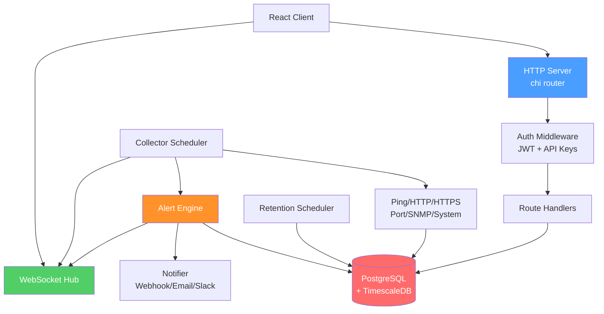

# Rayavriti NetMonitor — Go Backend Review

## Migration Completeness

> [!TIP]
> **The migration to Go is complete and successful.** The backend is fully functional.

| Check | Status |
|---|---|
| Build (`go build ./...`) | ✅ Passes |
| Tests (`go test ./...`) | ✅ All 14 packages pass |
| `go vet` | ⚠️ 2 IPv6 issues (see below) |
| No JS/TS/Python in `backend/` | ✅ Clean |
| Root `package.json` | ✅ Monorepo orchestrator only (client + simulator) |
| Database interface | ✅ Well-defined with Postgres implementation |
| Graceful shutdown | ✅ Proper signal handling + ordered teardown |

### Test Coverage Summary

| Package | Coverage |
|---|---|
| `httputil` | **100.0%** |
| `logging` | **99.4%** |
| `retention` | **97.2%** |
| `scheduler` | **95.1%** |
| `monitoring` | **94.9%** |
| `auth` | **93.1%** |
| `config` | **92.3%** |
| `scanner` | **92.3%** |
| `server` | **92.7%** |
| `engine` | **91.1%** |
| `handlers` | **89.2%** |
| `websocket` | **89.2%** |
| `collectors` | **78.9%** |
| `database` | **0.0%** (no test files — requires live Postgres) |
| `cmd/server` | **0.0%** (main entry, no test files) |

---

## 🔴 CRITICAL Issues

### 1. Command Injection via `tcpdump` filter — [capture.go:248-255](file:///home/yuvraj/Projects/Rayavriti%20NetMonitor/backend/internal/handlers/capture.go#L248-L255)

The `filter` parameter from the HTTP request body is passed **directly** to `tcpdump` as a command argument without any sanitization:

```go
args := []string{"-i", iface, "-nn", "-l", "-x"}
if filter != "" {
    args = append(args, filter) // ← UNSANITIZED USER INPUT
}
```

A malicious user can inject arbitrary commands by crafting a filter string containing shell metacharacters. While `exec.CommandContext` doesn't use a shell (mitigating `; rm -rf /`-style attacks), the `interface` parameter is also user-controlled and an attacker could specify arbitrary tcpdump flags.

**Fix:** Validate `interface` against `net.Interfaces()` list. Validate `filter` is a valid BPF expression (regex whitelist: alphanumerics, spaces, `and`, `or`, `not`, `host`, `port`, `net`, `src`, `dst`, parentheses, comparison operators).

---

### 2. Hardcoded Secrets in `.env` — [.env:6-8](file:///home/yuvraj/Projects/Rayavriti%20NetMonitor/.env#L6-L8)

```
JWT_SECRET= CYgT/6Gh0T5yc55qdGxJ8wTJlHz2rwQwyeOjh32fttU=
ADMIN_PASSWORD=admin@123
```

The `.env` file contains a real JWT secret and weak admin password. While `.env` is gitignored, it exists on disk and **the JWT secret has a leading space** which may cause subtle auth issues.

> [!WARNING]
> If this `.env` file was ever committed to git history, the JWT secret is compromised and should be rotated immediately.

---

### 3. Hardcoded Fallback Admin Password — [main.go:58-60](file:///home/yuvraj/Projects/Rayavriti%20NetMonitor/backend/cmd/server/main.go#L58-L60)

```go
if adminPass == "" {
    adminPass = "admin123"
    logger.Warn("Using default admin password - set ADMIN_PASSWORD env var")
}
```

If `ADMIN_PASSWORD` is not set, the server silently starts with `admin123`. This is a production risk. **Fix:** In production mode, refuse to start without an explicit admin password.

---

### 4. WebSocket Origin Bypass — [hub.go:78](file:///home/yuvraj/Projects/Rayavriti%20NetMonitor/backend/internal/websocket/hub.go#L78)

```go
CheckOrigin: func(r *http.Request) bool { return true },
```

This accepts WebSocket connections from **any origin**, enabling CSRF-style attacks where a malicious page can open a WS connection to the monitoring backend and exfiltrate live network data.

**Fix:** Validate the `Origin` header against a whitelist (same as CORS origins).

---

## 🟠 HIGH Severity Issues

### 5. Simulator Endpoints Accessible to Any Authenticated User — [server.go:229-233](file:///home/yuvraj/Projects/Rayavriti%20NetMonitor/backend/internal/server/server.go#L229-L233)

```go
r.Post("/api/simulator/metrics", simulator.Metrics)
r.Post("/api/simulator/flows", simulator.Flows)
r.Post("/api/simulator/alert", simulator.Alert)
```

These endpoints allow **any authenticated user** (even `viewer` role) to inject arbitrary metrics, flows, and alerts directly into the database. This is a data integrity risk.

**Fix:** Guard with `auth.RequireRole("admin")` or disable in production mode entirely.

---

### 6. `go vet` Failures — IPv6 Address Formatting

[port.go:21](file:///home/yuvraj/Projects/Rayavriti%20NetMonitor/backend/internal/collectors/port.go#L21) and [port_scanner.go:57](file:///home/yuvraj/Projects/Rayavriti%20NetMonitor/backend/internal/scanner/port_scanner.go#L57):

```go
addr := fmt.Sprintf("%s:%d", device.IPAddress, port)  // Breaks for IPv6!
```

IPv6 addresses require brackets: `[::1]:80`. This means **all IPv6 device monitoring is broken**.

**Fix:** Use `net.JoinHostPort(host, strconv.Itoa(port))`.

---

### 7. SNMP Community String Defaults to "public" — [snmp.go:36](file:///home/yuvraj/Projects/Rayavriti%20NetMonitor/backend/internal/collectors/snmp.go#L36)

```go
community := "public"
```

Using "public" as default is a known security anti-pattern. SNMP community strings are effectively passwords sent in cleartext (SNMPv1/v2c).

**Fix:** Require explicit community strings. Warn (or refuse) when "public" is used in production.

---

### 8. SNMP Uses `ConnectIPv4()` Only — [snmp.go:60](file:///home/yuvraj/Projects/Rayavriti%20NetMonitor/backend/internal/collectors/snmp.go#L60)

```go
if err := g.ConnectIPv4(); err != nil {
```

This hardcodes IPv4, so SNMP monitoring of IPv6 targets will always fail silently (returns "down").

**Fix:** Use `g.Connect()` which handles both IPv4 and IPv6.

---

### 9. Refresh Token Reuse — No Token Rotation or Blacklisting

[auth.go:80-98](file:///home/yuvraj/Projects/Rayavriti%20NetMonitor/backend/internal/handlers/auth.go#L80-L98): The `Refresh` handler issues a new token pair from an old refresh token but **never invalidates the old token**. This means:
- A stolen refresh token can be used indefinitely
- There's no way to force logout a user
- `DeleteSession` in `Logout` doesn't actually revoke the JWT

**Fix:** Implement a token blacklist (Redis or DB table), or use opaque refresh tokens stored server-side.

---

### 10. API Key Deletion Without Ownership Check — [auth.go:183-194](file:///home/yuvraj/Projects/Rayavriti%20NetMonitor/backend/internal/handlers/auth.go#L183-L194)

```go
func (h *AuthHandler) DeleteAPIKey(w http.ResponseWriter, r *http.Request) {
    id, err := parseID(chi.URLParam(r, "id"))
    // ... no ownership check ...
    if err := h.db.DeleteAPIKey(r.Context(), id); err != nil {
```

Any authenticated user can delete **any other user's** API key by guessing the ID (sequential integers).

**Fix:** Verify `claims.UserID` matches the key's owner before deletion.

---

### 11. No `ReadTimeout` / `WriteTimeout` on HTTP Server — [server.go:240-243](file:///home/yuvraj/Projects/Rayavriti%20NetMonitor/backend/internal/server/server.go#L240-L243)

```go
s.httpServer = &http.Server{
    Addr:    fmt.Sprintf(":%d", s.cfg.App.Port),
    Handler: r,
}
```

Missing timeouts make the server vulnerable to slowloris-style DoS attacks where connections are held open indefinitely.

**Fix:**
```go
s.httpServer = &http.Server{
    Addr:         fmt.Sprintf(":%d", s.cfg.App.Port),
    Handler:      r,
    ReadTimeout:  15 * time.Second,
    WriteTimeout: 30 * time.Second,
    IdleTimeout:  60 * time.Second,
}
```

---

## 🟡 MEDIUM Severity Issues

### 12. Device List Fetches ALL Devices Then Filters In-Memory — [devices.go:33-150](file:///home/yuvraj/Projects/Rayavriti%20NetMonitor/backend/internal/handlers/devices.go#L33-L150)

`GetDevices()` loads the entire devices table, then filters by status, protocol, enabled, search term, sorts, and paginates — all in Go. With hundreds or thousands of devices, this becomes a significant performance bottleneck.

**Fix:** Push filters, sorting, and pagination into the SQL query.

---

### 13. `findActiveAlertForRule` Scans All Active Alerts — [alert.go:392-404](file:///home/yuvraj/Projects/Rayavriti%20NetMonitor/backend/internal/engine/alert.go#L392-L404)

```go
func (e *AlertEngine) findActiveAlertForRule(ctx context.Context, ruleID, deviceID int64) *models.Alert {
    alerts, _, err := e.db.GetAlerts(ctx, "active", 200, 0)
    // linear scan through all 200 alerts...
```

This is called on **every metric collection for every rule**, creating an O(devices × rules × alerts) hotspot.

**Fix:** Add a `FindActiveAlertByRuleAndDevice(ctx, ruleID, deviceID)` method to the database interface.

---

### 14. `GetLatestMetrics` Called Per-Device in Scheduler — [scheduler.go:194-201](file:///home/yuvraj/Projects/Rayavriti%20NetMonitor/backend/internal/scheduler/scheduler.go#L194-L201)

```go
if latest, err := s.db.GetLatestMetrics(ctx); err == nil {
    for _, m := range latest {
        if m.DeviceID == device.ID {
```

`GetLatestMetrics` runs a `DISTINCT ON` query across all devices. This is called once per device per collection cycle. With 100 devices at 60s intervals, that's ~100 full-table scans per minute.

**Fix:** Use a `GetLatestMetricForDevice(ctx, deviceID)` method.

---

### 15. `GetDashboardStats` Runs 6 Separate Queries — [postgres.go:730-764](file:///home/yuvraj/Projects/Rayavriti%20NetMonitor/backend/internal/database/postgres.go#L730-L764)

Six sequential `SELECT COUNT(*)` queries for dashboard stats. This is also called on every WebSocket connection bootstrap.

**Fix:** Combine into a single query using `COUNT(*) FILTER (WHERE ...)`.

---

### 16. CORS Allows All Origins in Non-Production — [server.go:34](file:///home/yuvraj/Projects/Rayavriti%20NetMonitor/backend/internal/server/server.go#L34)

```go
allowAll := s.cfg.App.NodeEnv != "production" || len(s.cfg.App.CORSOrigins) == 0
```

Even in production, if `CORS_ORIGINS` is empty (which is the default in `.env.example`), **all origins are allowed**.

**Fix:** In production, require explicit CORS origins and refuse to start without them.

---

### 17. Rate Limiter Goroutines Never Stop — [middleware.go:39-50](file:///home/yuvraj/Projects/Rayavriti%20NetMonitor/backend/internal/server/middleware.go#L39-L50) and [middleware.go:105-116](file:///home/yuvraj/Projects/Rayavriti%20NetMonitor/backend/internal/auth/middleware.go#L105-L116)

Both rate limiter cleanup goroutines run `for { time.Sleep(...) }` with no way to stop them. They'll leak on shutdown.

**Fix:** Accept a `context.Context` and select on `ctx.Done()`.

---

### 18. `ListSessions` Ignores Limit Parameter — [capture.go:230-244](file:///home/yuvraj/Projects/Rayavriti%20NetMonitor/backend/internal/handlers/capture.go#L230-L244)

The limit is parsed from query params but `GetCaptureSessions` is called without it, then truncated in Go. This fetches all sessions from the database unnecessarily.

---

### 19. Port Scan Concurrency/Timeout Not Bounded — [devices.go:288-294](file:///home/yuvraj/Projects/Rayavriti%20NetMonitor/backend/internal/handlers/devices.go#L288-L294)

User-provided `concurrency` and `timeoutMs` have no upper bounds. A malicious user could set `concurrency: 100000` and `timeoutMs: 300000` to consume resources.

**Fix:** Cap concurrency at ~500, timeout at ~10s.

---

### 20. Verify2FA is a No-Op — [auth.go:137-139](file:///home/yuvraj/Projects/Rayavriti%20NetMonitor/backend/internal/handlers/auth.go#L137-L139)

```go
func (h *AuthHandler) Verify2FA(w http.ResponseWriter, r *http.Request) {
    httputil.SendOK(w, map[string]bool{"verified": true})
}
```

This endpoint always returns success, giving a false sense of security. Either implement 2FA or remove the endpoint.

---

### 21. Database Pool Config Not Applied — [postgres.go:26-37](file:///home/yuvraj/Projects/Rayavriti%20NetMonitor/backend/internal/database/postgres.go#L26-L37)

The `Config` struct has `MaxConns`, `MinConns`, `MaxConnLifetime`, and `HealthCheckPeriod` — but `NewPostgres` only takes the DSN and `Connect()` doesn't apply these pool settings.

**Fix:** Pass `DatabaseConfig` to `NewPostgres` and apply pool settings to `pgxpool.Config`.

---

### 22. Retention Prune Uses `DELETE` — Not Efficient for TimescaleDB

[postgres.go:713-726](file:///home/yuvraj/Projects/Rayavriti%20NetMonitor/backend/internal/database/postgres.go#L713-L726): Plain `DELETE FROM metrics WHERE timestamp < $1` is very slow on large TimescaleDB hypertables. TimescaleDB provides `drop_chunks()` which is orders of magnitude faster.

---

## 🔵 LOW Severity / Code Quality Issues

### 23. `NODE_ENV` Used for Go Config

[.env:2](file:///home/yuvraj/Projects/Rayavriti%20NetMonitor/.env#L2) and [config.go:99](file:///home/yuvraj/Projects/Rayavriti%20NetMonitor/backend/internal/config/config.go#L99): `NODE_ENV` is a Node.js convention. Should use `APP_ENV` or `GO_ENV` instead. This is a migration artifact.

### 24. Dead Code in SNMP Collector — [snmp.go:138-141](file:///home/yuvraj/Projects/Rayavriti%20NetMonitor/backend/internal/collectors/snmp.go#L138-L141)

```go
cpuLoads := append([]float64{}, val)
_ = cpuLoads  // unused
```

### 25. SNMP Interface Sorting Uses Bubble Sort — [snmp.go:388-396](file:///home/yuvraj/Projects/Rayavriti%20NetMonitor/backend/internal/collectors/snmp.go#L388-L396)

Should use `sort.Slice()` instead of manual bubble sort.

### 26. `isValidIPv4` Doesn't Validate Octet Ranges — [capture.go:667-678](file:///home/yuvraj/Projects/Rayavriti%20NetMonitor/backend/internal/handlers/capture.go#L667-L678)

Accepts `999.999.999.999` as valid. Should check `0 <= octet <= 255`.

### 27. Missing `ErrNoRows` Differentiation in Handlers

Several handlers return `500` when they should return `404`. For example, [devices.go:249-252](file:///home/yuvraj/Projects/Rayavriti%20NetMonitor/backend/internal/handlers/devices.go#L249-L252): `DeleteDevice` returns `500` for non-existent devices.

### 28. No Database Tests

The `database` package has 0% coverage because it requires a live Postgres connection. Consider using [testcontainers-go](https://testcontainers.com/guides/getting-started-with-testcontainers-for-go/) for integration tests.

### 29. Password Hash Returned in `/api/auth/me`

[auth.go:72-78](file:///home/yuvraj/Projects/Rayavriti%20NetMonitor/backend/internal/handlers/auth.go#L72-L78): While the `User` model has `json:"-"` on `PasswordHash`, the full `user` struct (including `RoleID`, `Phone`, etc.) is returned. Consider a dedicated `UserResponse` struct.

### 30. `Login` and `V1Login` Are Nearly Identical — [auth.go:24-55](file:///home/yuvraj/Projects/Rayavriti%20NetMonitor/backend/internal/handlers/auth.go#L24-L55) vs [auth.go:100-135](file:///home/yuvraj/Projects/Rayavriti%20NetMonitor/backend/internal/handlers/auth.go#L100-L135)

~80% duplicated code. Extract a shared `authenticate()` method.

### 31. SNMP Collector Creates 5 Goroutines Using Shared `*GoSNMP`

[snmp.go:87-114](file:///home/yuvraj/Projects/Rayavriti%20NetMonitor/backend/internal/collectors/snmp.go#L87-L114): The `gosnmp.GoSNMP` struct uses a single connection, and 5 goroutines concurrently call methods on it. This is a **data race** — `gosnmp` is **not** goroutine-safe.

### 32. `splitStatements` in Migrations is Naive

[postgres.go:84-94](file:///home/yuvraj/Projects/Rayavriti%20NetMonitor/backend/internal/database/postgres.go#L84-L94): Splitting on `;` breaks SQL containing string literals with semicolons (e.g., `INSERT INTO ... VALUES('foo;bar')`).

### 33. No Request ID / Correlation Tracking

No request ID middleware for correlating logs across a single request lifecycle.

---

## Architecture Assessment

### What's Done Well ✅

- **Clean package structure**: Follows Go conventions (`cmd/`, `internal/`)
- **Dependency injection**: Handlers take `database.Database` interface, enabling testability
- **Comprehensive mock database**: [mock_db_test.go](file:///home/yuvraj/Projects/Rayavriti%20NetMonitor/backend/internal/handlers/mock_db_test.go) enables thorough handler testing
- **Graceful shutdown**: Ordered teardown of scheduler → anomaly engine → retention → WebSocket hub → HTTP server
- **Scrypt password hashing**: With constant-time comparison and legacy SHA256 migration path
- **JWT algorithm enforcement**: Validates signing method is HMAC, preventing algorithm confusion attacks
- **Security headers**: Comprehensive set (CSP, HSTS, X-Frame-Options, etc.)
- **Rate limiting**: Both per-IP (server middleware) and per-user (auth middleware)
- **Alert engine state machine**: Sophisticated pending → firing → notified → resolved lifecycle with cooldown
- **WebSocket auth**: Requires valid JWT before upgrading connections
- **Request body size limit**: 1MB cap via `http.MaxBytesReader`

### Architecture Diagram



---

## Prioritized Recommendations

### Must-Fix Before Production

| # | Issue | Effort |
|---|---|---|
| 1 | Sanitize `tcpdump` interface + filter inputs | Small |
| 2 | Remove/rotate secrets from `.env` | Small |
| 3 | Refuse default admin password in production | Small |
| 4 | Add WebSocket origin validation | Small |
| 5 | Guard simulator endpoints with admin role | Small |
| 6 | Fix IPv6 address formatting (`net.JoinHostPort`) | Small |
| 7 | Add HTTP server timeouts | Small |
| 10 | Add ownership check to API key deletion | Small |

### Should-Fix Soon

| # | Issue | Effort |
|---|---|---|
| 9 | Implement refresh token rotation/blacklisting | Medium |
| 11 | Fix HTTP server timeouts | Small |
| 12 | Push device filtering to SQL | Medium |
| 13 | Add `FindActiveAlertByRuleAndDevice` DB query | Small |
| 14 | Add `GetLatestMetricForDevice` DB query | Small |
| 15 | Combine dashboard stats into single query | Small |
| 16 | Fix CORS production default | Small |
| 21 | Apply pool config to pgxpool | Small |
| 31 | Fix SNMP goroutine race condition | Medium |

### Nice-to-Have

| # | Issue | Effort |
|---|---|---|
| 17 | Make rate limiter goroutines cancellable | Small |
| 22 | Use TimescaleDB `drop_chunks()` for retention | Small |
| 23 | Rename `NODE_ENV` to `APP_ENV` | Small |
| 28 | Add database integration tests | Large |
| 30 | Deduplicate Login/V1Login | Small |
| 33 | Add request ID middleware | Small |

---

## Overall Verdict

The Go migration is **structurally complete and well-architected**. The codebase demonstrates good Go idioms, clean package separation, comprehensive test coverage (most packages >90%), and a well-designed database interface abstraction. The alert engine's state machine is particularly impressive.

The main risks before production are:
1. **Security** — tcpdump command injection, WebSocket origin bypass, unguarded simulator endpoints
2. **Performance** — in-memory device filtering and N+1 query patterns will degrade at scale  
3. **Operational** — missing HTTP timeouts, unrotated refresh tokens, weak production defaults
