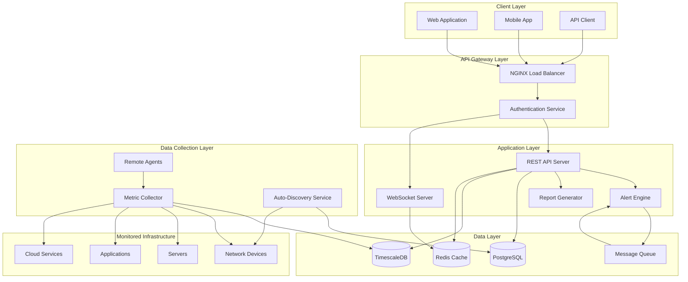
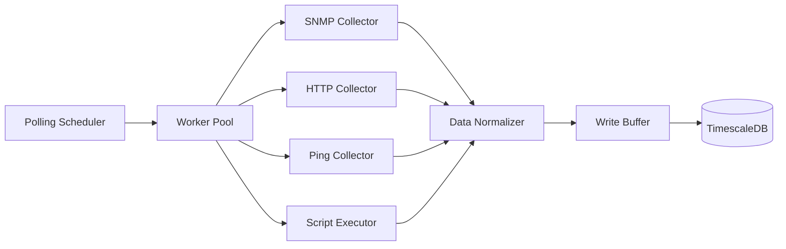
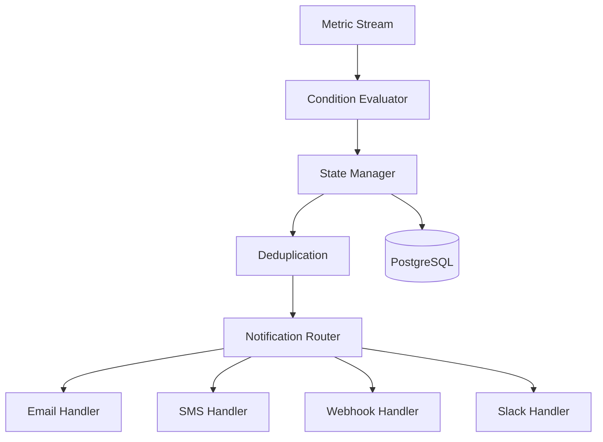
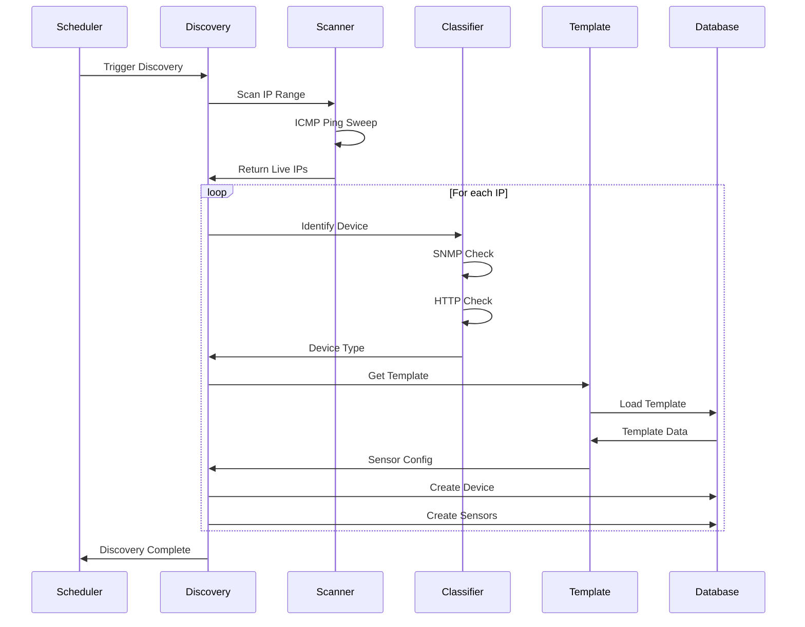
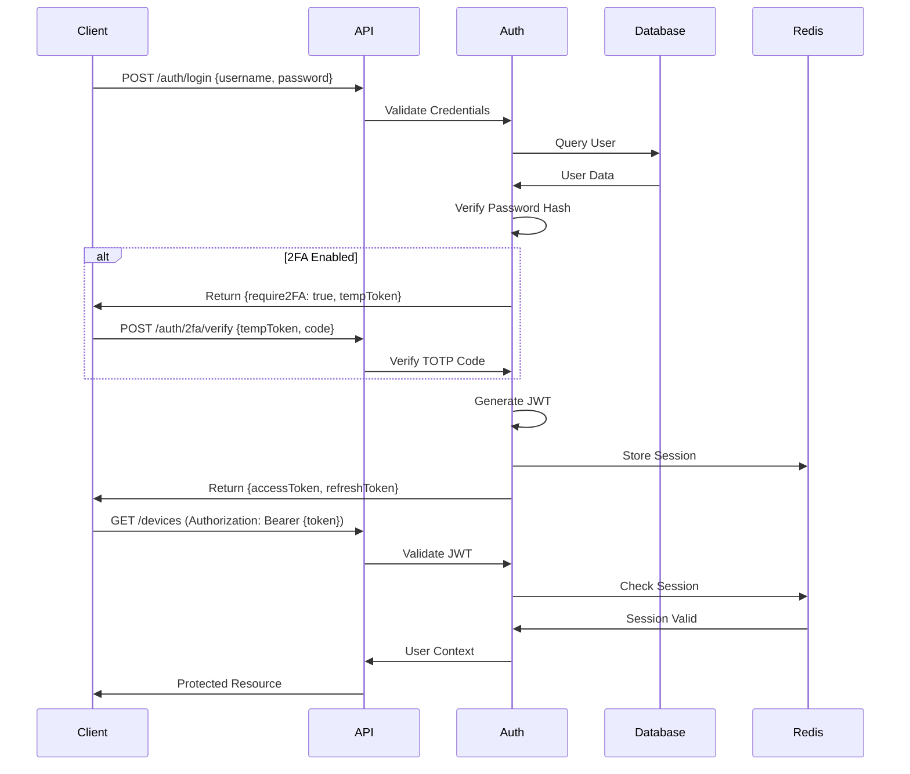

# Technical Specification Document
## Simplified Network Monitoring System

**Version:** 1.0  
**Date:** January 19, 2026  
**Status:** Draft

---

## Table of Contents
1. [System Architecture](#system-architecture)
2. [Technology Stack](#technology-stack)
3. [Component Design](#component-design)
4. [Data Models](#data-models)
5. [API Specifications](#api-specifications)
6. [Security Architecture](#security-architecture)
7. [Deployment Architecture](#deployment-architecture)
8. [Performance Optimization](#performance-optimization)

---

## System Architecture

### High-Level Architecture



### Architecture Patterns

#### 1. Microservices Architecture
- **Metric Collector Service**: Data collection and normalization
- **API Service**: RESTful API and business logic
- **Alert Service**: Alert evaluation and notification
- **Report Service**: Report generation and scheduling
- **WebSocket Service**: Real-time data streaming

#### 2. Event-Driven Architecture
- **Message Queue**: RabbitMQ/Redis for async processing
- **Event Bus**: Publish-subscribe pattern for alerts
- **Stream Processing**: Real-time metric aggregation

#### 3. Time-Series Data Management
- **Hot Storage**: Recent data (last 7 days) in memory/Redis
- **Warm Storage**: Medium-term data (8-90 days) in TimescaleDB
- **Cold Storage**: Long-term data (90+ days) compressed in TimescaleDB

---

## Technology Stack

### Frontend Stack

| Component | Technology | Version | Purpose |
|-----------|-----------|---------|---------|
| Framework | React | 18.x | UI component framework |
| Language | TypeScript | 5.x | Type-safe JavaScript |
| State Management | Redux Toolkit | 2.x | Application state |
| Styling | TailwindCSS | 3.x | Utility-first CSS |
| Charts | Recharts / D3.js | Latest | Data visualization |
| Real-time | Socket.IO Client | 4.x | WebSocket client |
| HTTP Client | Axios | 1.x | API communication |
| Routing | React Router | 6.x | Client-side routing |
| Testing | Jest + RTL | Latest | Unit/integration tests |

### Backend Stack

| Component | Technology | Version | Purpose |
|-----------|-----------|---------|---------|
| API Framework | Node.js + Express | 20.x / 4.x | RESTful API server |
| Alternative | Python + FastAPI | 3.11 / 0.1x | High-performance API |
| Language | TypeScript | 5.x | Type-safe backend |
| WebSocket | Socket.IO | 4.x | Real-time communication |
| ORM | Prisma / TypeORM | Latest | Database abstraction |
| Validation | Zod / Joi | Latest | Input validation |
| Authentication | Passport.js | 0.7.x | Auth strategies |
| Caching | Redis | 7.x | Session & data cache |
| Message Queue | RabbitMQ | 3.x | Async task queue |
| Monitoring Agent | Go | 1.21+ | Lightweight agents |
| Testing | Jest / pytest | Latest | Backend testing |

### Database Stack

| Component | Technology | Version | Purpose |
|-----------|-----------|---------|---------|
| RDBMS | PostgreSQL | 15.x | Relational data |
| Time-Series | TimescaleDB | 2.x | Metric storage |
| Cache | Redis | 7.x | In-memory cache |
| Search | Elasticsearch | 8.x | Log search (optional) |

### Infrastructure Stack

| Component | Technology | Version | Purpose |
|-----------|-----------|---------|---------|
| Containerization | Docker | 24.x | Application containers |
| Orchestration | Docker Compose | 2.x | Multi-container apps |
| Web Server | NGINX | 1.25.x | Reverse proxy & LB |
| Process Manager | PM2 | 5.x | Node.js process mgmt |
| CI/CD | GitHub Actions | N/A | Automation pipeline |
| Monitoring | Prometheus | 2.x | System monitoring |

---

## Component Design

### 1. Metric Collector Service

#### Responsibilities
- Poll devices at configured intervals
- Normalize data from various protocols
- Handle connection failures and retries
- Write metrics to TimescaleDB

#### Architecture



#### Key Components

**Polling Scheduler**
```typescript
interface PollingScheduler {
  scheduleDevice(deviceId: string, interval: number): void;
  updateSchedule(deviceId: string, interval: number): void;
  removeDevice(deviceId: string): void;
  getNextPoll(deviceId: string): Date;
}
```

**Collector Interface**
```typescript
interface Collector {
  collect(device: Device, sensor: Sensor): Promise<MetricData>;
  validate(device: Device): Promise<boolean>;
  getCapabilities(): CollectorCapabilities;
}
```

**Data Normalizer**
```typescript
interface MetricData {
  deviceId: string;
  sensorId: string;
  timestamp: Date;
  channels: {
    name: string;
    value: number;
    unit: string;
  }[];
  status: 'ok' | 'warning' | 'error';
}
```

### 2. Alert Engine

#### Responsibilities
- Evaluate alert conditions in real-time
- Manage alert states (triggered, acknowledged, resolved)
- Route notifications to appropriate channels
- Implement escalation policies
- Handle alert dependencies

#### Architecture



#### Alert Rule Engine

```typescript
interface AlertRule {
  id: string;
  name: string;
  conditions: AlertCondition[];
  logic: 'AND' | 'OR';
  severity: 'info' | 'warning' | 'error' | 'critical';
  notifications: NotificationConfig[];
  escalation?: EscalationPolicy;
  dependencies?: string[]; // Parent rule IDs
}

interface AlertCondition {
  channel: string;
  operator: '>' | '<' | '=' | '!=' | '>=' | '<=';
  threshold: number;
  duration?: number; // Sustained violation duration
}

interface NotificationConfig {
  channel: 'email' | 'sms' | 'webhook' | 'slack';
  recipients: string[];
  template?: string;
  delay?: number; // Delay before sending
}
```

### 3. API Service

#### REST API Structure

```
/api/v1
├── /auth
│   ├── POST /login
│   ├── POST /logout
│   ├── POST /refresh
│   └── POST /2fa/verify
├── /devices
│   ├── GET /devices
│   ├── GET /devices/:id
│   ├── POST /devices
│   ├── PUT /devices/:id
│   ├── DELETE /devices/:id
│   └── GET /devices/:id/metrics
├── /sensors
│   ├── GET /sensors
│   ├── GET /sensors/:id
│   ├── POST /sensors
│   ├── PUT /sensors/:id
│   └── DELETE /sensors/:id
├── /alerts
│   ├── GET /alerts
│   ├── GET /alerts/:id
│   ├── POST /alerts
│   ├── PUT /alerts/:id
│   ├── DELETE /alerts/:id
│   ├── POST /alerts/:id/acknowledge
│   └── POST /alerts/:id/resolve
├── /dashboards
│   ├── GET /dashboards
│   ├── GET /dashboards/:id
│   ├── POST /dashboards
│   ├── PUT /dashboards/:id
│   └── DELETE /dashboards/:id
├── /reports
│   ├── GET /reports
│   ├── GET /reports/:id
│   ├── POST /reports/generate
│   └── GET /reports/:id/download
├── /users
│   ├── GET /users
│   ├── GET /users/:id
│   ├── POST /users
│   ├── PUT /users/:id
│   └── DELETE /users/:id
└── /metrics
    ├── GET /metrics/query
    ├── GET /metrics/aggregate
    └── POST /metrics/export
```

#### API Response Format

```typescript
interface APIResponse<T> {
  success: boolean;
  data?: T;
  error?: {
    code: string;
    message: string;
    details?: any;
  };
  meta?: {
    timestamp: string;
    requestId: string;
    pagination?: {
      page: number;
      pageSize: number;
      total: number;
      totalPages: number;
    };
  };
}
```

### 4. WebSocket Service

#### Real-Time Events

```typescript
// Client → Server
interface ClientEvents {
  'subscribe:device': (deviceId: string) => void;
  'unsubscribe:device': (deviceId: string) => void;
  'subscribe:dashboard': (dashboardId: string) => void;
  'acknowledge:alert': (alertId: string) => void;
}

// Server → Client
interface ServerEvents {
  'metric:update': (data: MetricUpdate) => void;
  'alert:triggered': (alert: Alert) => void;
  'alert:resolved': (alertId: string) => void;
  'device:status': (status: DeviceStatus) => void;
  'connection:status': (status: ConnectionStatus) => void;
}

interface MetricUpdate {
  deviceId: string;
  sensorId: string;
  channels: {
    name: string;
    value: number;
    timestamp: string;
  }[];
}
```

### 5. Auto-Discovery Service

#### Discovery Process Flow



#### Discovery Configuration

```typescript
interface DiscoveryProfile {
  id: string;
  name: string;
  schedule: CronExpression;
  ranges: IPRange[];
  protocols: DiscoveryProtocol[];
  credentials: CredentialSet[];
  autoCreate: boolean;
  applyTemplates: boolean;
}

interface IPRange {
  start: string; // e.g., "192.168.1.1"
  end: string;   // e.g., "192.168.1.254"
  exclude?: string[]; // Excluded IPs
}

type DiscoveryProtocol = 'icmp' | 'snmp' | 'http' | 'ssh' | 'wmi';
```

---

## Data Models

### Database Schema (PostgreSQL)

#### Users & Authentication

```sql
CREATE TABLE users (
  id UUID PRIMARY KEY DEFAULT gen_random_uuid(),
  username VARCHAR(100) UNIQUE NOT NULL,
  email VARCHAR(255) UNIQUE NOT NULL,
  password_hash VARCHAR(255) NOT NULL,
  role_id UUID REFERENCES roles(id),
  is_active BOOLEAN DEFAULT true,
  require_2fa BOOLEAN DEFAULT false,
  totp_secret VARCHAR(255),
  created_at TIMESTAMP DEFAULT NOW(),
  updated_at TIMESTAMP DEFAULT NOW(),
  last_login TIMESTAMP
);

CREATE TABLE roles (
  id UUID PRIMARY KEY DEFAULT gen_random_uuid(),
  name VARCHAR(50) UNIQUE NOT NULL,
  permissions JSONB NOT NULL,
  is_system BOOLEAN DEFAULT false,
  created_at TIMESTAMP DEFAULT NOW()
);

CREATE TABLE api_keys (
  id UUID PRIMARY KEY DEFAULT gen_random_uuid(),
  user_id UUID REFERENCES users(id) ON DELETE CASCADE,
  key_hash VARCHAR(255) NOT NULL,
  name VARCHAR(100),
  permissions JSONB,
  expires_at TIMESTAMP,
  last_used TIMESTAMP,
  created_at TIMESTAMP DEFAULT NOW()
);
```

#### Devices & Sensors

```sql
CREATE TABLE devices (
  id UUID PRIMARY KEY DEFAULT gen_random_uuid(),
  name VARCHAR(255) NOT NULL,
  type VARCHAR(50) NOT NULL, -- 'server', 'router', 'switch', 'firewall', etc.
  ip_address INET,
  hostname VARCHAR(255),
  status VARCHAR(20) DEFAULT 'active', -- 'active', 'paused', 'error'
  parent_id UUID REFERENCES devices(id),
  location VARCHAR(255),
  tags JSONB,
  metadata JSONB,
  created_at TIMESTAMP DEFAULT NOW(),
  updated_at TIMESTAMP DEFAULT NOW()
);

CREATE TABLE sensors (
  id UUID PRIMARY KEY DEFAULT gen_random_uuid(),
  device_id UUID REFERENCES devices(id) ON DELETE CASCADE,
  name VARCHAR(255) NOT NULL,
  type VARCHAR(50) NOT NULL, -- 'ping', 'snmp', 'http', 'script', etc.
  config JSONB NOT NULL,
  interval INTEGER DEFAULT 60, -- Polling interval in seconds
  status VARCHAR(20) DEFAULT 'active',
  last_poll TIMESTAMP,
  last_value JSONB,
  created_at TIMESTAMP DEFAULT NOW(),
  updated_at TIMESTAMP DEFAULT NOW()
);

CREATE TABLE sensor_channels (
  id UUID PRIMARY KEY DEFAULT gen_random_uuid(),
  sensor_id UUID REFERENCES sensors(id) ON DELETE CASCADE,
  name VARCHAR(100) NOT NULL,
  unit VARCHAR(20),
  format VARCHAR(20) DEFAULT 'number',
  limits JSONB, -- {min, max, warning_min, warning_max, error_min, error_max}
  created_at TIMESTAMP DEFAULT NOW()
);
```

#### Alerts & Notifications

```sql
CREATE TABLE alert_rules (
  id UUID PRIMARY KEY DEFAULT gen_random_uuid(),
  name VARCHAR(255) NOT NULL,
  sensor_id UUID REFERENCES sensors(id) ON DELETE CASCADE,
  conditions JSONB NOT NULL,
  severity VARCHAR(20) DEFAULT 'warning',
  enabled BOOLEAN DEFAULT true,
  notifications JSONB NOT NULL,
  escalation JSONB,
  parent_rule_id UUID REFERENCES alert_rules(id),
  created_by UUID REFERENCES users(id),
  created_at TIMESTAMP DEFAULT NOW(),
  updated_at TIMESTAMP DEFAULT NOW()
);

CREATE TABLE alerts (
  id UUID PRIMARY KEY DEFAULT gen_random_uuid(),
  rule_id UUID REFERENCES alert_rules(id),
  device_id UUID REFERENCES devices(id),
  sensor_id UUID REFERENCES sensors(id),
  severity VARCHAR(20) NOT NULL,
  status VARCHAR(20) DEFAULT 'triggered', -- 'triggered', 'acknowledged', 'resolved'
  message TEXT NOT NULL,
  triggered_at TIMESTAMP DEFAULT NOW(),
  acknowledged_at TIMESTAMP,
  acknowledged_by UUID REFERENCES users(id),
  resolved_at TIMESTAMP,
  metadata JSONB
);

CREATE TABLE alert_notifications (
  id UUID PRIMARY KEY DEFAULT gen_random_uuid(),
  alert_id UUID REFERENCES alerts(id) ON DELETE CASCADE,
  channel VARCHAR(50) NOT NULL,
  recipient VARCHAR(255) NOT NULL,
  status VARCHAR(20) DEFAULT 'pending',
  sent_at TIMESTAMP,
  error_message TEXT,
  created_at TIMESTAMP DEFAULT NOW()
);
```

#### Dashboards

```sql
CREATE TABLE dashboards (
  id UUID PRIMARY KEY DEFAULT gen_random_uuid(),
  name VARCHAR(255) NOT NULL,
  description TEXT,
  owner_id UUID REFERENCES users(id),
  is_public BOOLEAN DEFAULT false,
  layout JSONB NOT NULL,
  refresh_interval INTEGER DEFAULT 30,
  created_at TIMESTAMP DEFAULT NOW(),
  updated_at TIMESTAMP DEFAULT NOW()
);

CREATE TABLE dashboard_widgets (
  id UUID PRIMARY KEY DEFAULT gen_random_uuid(),
  dashboard_id UUID REFERENCES dashboards(id) ON DELETE CASCADE,
  type VARCHAR(50) NOT NULL, -- 'chart', 'gauge', 'status', 'map', etc.
  config JSONB NOT NULL,
  position JSONB NOT NULL, -- {x, y, w, h}
  created_at TIMESTAMP DEFAULT NOW()
);
```

### Time-Series Schema (TimescaleDB)

```sql
CREATE TABLE metrics (
  time TIMESTAMPTZ NOT NULL,
  device_id UUID NOT NULL,
  sensor_id UUID NOT NULL,
  channel_id UUID NOT NULL,
  value DOUBLE PRECISION,
  status VARCHAR(20),
  metadata JSONB
);

-- Create hypertable for automatic partitioning
SELECT create_hypertable('metrics', 'time');

-- Create indexes for efficient querying
CREATE INDEX idx_metrics_device_time ON metrics (device_id, time DESC);
CREATE INDEX idx_metrics_sensor_time ON metrics (sensor_id, time DESC);
CREATE INDEX idx_metrics_channel_time ON metrics (channel_id, time DESC);

-- Continuous aggregate for hourly data
CREATE MATERIALIZED VIEW metrics_hourly
WITH (timescaledb.continuous) AS
SELECT
  time_bucket('1 hour', time) AS bucket,
  device_id,
  sensor_id,
  channel_id,
  AVG(value) as avg_value,
  MIN(value) as min_value,
  MAX(value) as max_value,
  COUNT(*) as sample_count
FROM metrics
GROUP BY bucket, device_id, sensor_id, channel_id;

-- Continuous aggregate for daily data
CREATE MATERIALIZED VIEW metrics_daily
WITH (timescaledb.continuous) AS
SELECT
  time_bucket('1 day', time) AS bucket,
  device_id,
  sensor_id,
  channel_id,
  AVG(value) as avg_value,
  MIN(value) as min_value,
  MAX(value) as max_value,
  COUNT(*) as sample_count
FROM metrics
GROUP BY bucket, device_id, sensor_id, channel_id;

-- Data retention policy (keep raw data for 90 days)
SELECT add_retention_policy('metrics', INTERVAL '90 days');
```

---

## Security Architecture

### Authentication Flow



### Security Measures

#### 1. Authentication
- **Password Hashing**: bcrypt with salt rounds = 12
- **JWT Tokens**: 
  - Access Token: 15 minutes expiry
  - Refresh Token: 7 days expiry
- **2FA**: TOTP-based (Google Authenticator compatible)
- **API Keys**: SHA-256 hashed, scoped permissions

#### 2. Authorization
- **RBAC Implementation**: Role-based access control
- **Resource-Level ACLRights**: Device/sensor level permissions
- **JWT Claims**: Include user roles and permissions

#### 3. Data Protection
- **TLS/SSL**: Force HTTPS for all communications
- **Database Encryption**: Encrypt sensitive fields at rest
- **Credential Storage**: Encrypted device credentials (AES-256)
- **Audit Logging**: Log all sensitive operations

#### 4. Input Validation
- **Schema Validation**: Use Zod/Joi for request validation
- **SQL Injection Prevention**: Parameterized queries (Prisma ORM)
- **XSS Prevention**: Output encoding, CSP headers
- **Rate Limiting**: Prevent brute-force attacks

#### 5. Network Security
- **CORS Configuration**: Restrict allowed origins
- **Security Headers**: 
  - X-Frame-Options: DENY
  - X-Content-Type-Options: nosniff
  - Strict-Transport-Security
  - Content-Security-Policy

---

## Deployment Architecture

### Container Architecture

```yaml
# docker-compose.yml structure
version: '3.8'

services:
  nginx:
    # Reverse proxy and load balancer
    
  api:
    # REST API service (scalable)
    
  websocket:
    # WebSocket service (scalable)
    
  collector:
    # Metric collection service (scalable)
    
  alert-engine:
    # Alert evaluation service
    
  postgres:
    # Primary database
    
  timescaledb:
    # Time-series database
    
  redis:
    # Cache and session storage
    
  rabbitmq:
    # Message queue for async tasks
```

### Scaling Strategy

#### Horizontal Scaling
- **API Servers**: Behind load balancer (3+ instances)
- **Collectors**: Distributed across network segments
- **Database**: Read replicas for query performance

#### Vertical Scaling
- **TimescaleDB**: High-memory instances for time-series data
- **Redis**: Optimize for in-memory operations

---

## Performance Optimization

### Database Optimization

#### Query Optimization
```sql
-- Use appropriate indexes
CREATE INDEX CONCURRENTLY idx_devices_status ON devices(status) 
  WHERE status = 'active';

-- Partition large tables
CREATE TABLE alert_history (LIKE alerts) 
  PARTITION BY RANGE (triggered_at);

-- Use materialized views for heavy queries
CREATE MATERIALIZED VIEW device_summary AS
  SELECT 
    d.id,
    d.name,
    COUNT(s.id) as sensor_count,
    COUNT(CASE WHEN a.status = 'triggered' THEN 1 END) as active_alerts
  FROM devices d
  LEFT JOIN sensors s ON d.id = s.device_id
  LEFT JOIN alerts a ON d.id = a.device_id
  GROUP BY d.id, d.name;
```

#### Caching Strategy
- **Redis Cache Layers**:
  - L1: Active device status (30s TTL)
  - L2: Dashboard data (60s TTL)
  - L3: Report data (5m TTL)

### Frontend Optimization

#### Performance Techniques
- **Code Splitting**: Lazy load routes and components
- **Memoization**: React.memo for expensive components
- **Virtual Scrolling**: For large device lists
- **WebSocket Throttling**: Debounce rapid updates
- **Service Workers**: Cache static assets

### Monitoring Collection Optimization

#### Intelligent Polling
```typescript
interface AdaptivePolling {
  // Increase interval for stable metrics
  increaseInterval(sensorId: string): void;
  
  // Decrease interval for unstable metrics
  decreaseInterval(sensorId: string): void;
  
  // Adjust based on change rate
  adaptInterval(sensorId: string, changeRate: number): void;
}
```

#### Batch Processing
- Collect multiple metrics in single SNMP request
- Batch database writes (every 10 seconds)
- Aggregate data before storage

---

## Appendix

### A. Technology Justifications

**Why TimescaleDB?**
- PostgreSQL extension (familiar SQL)
- Excellent time-series performance
- Automatic data retention and compression
- Continuous aggregates for rollups

**Why Redis?**
- Sub-millisecond latency for real-time data
- Pub/Sub for WebSocket broadcasting
- Session storage with TTL support

**Why Go for Agents?**
- Low resource footprint
- Fast execution
- Easy cross-compilation
- Excellent concurrency

### B. Alternative Technologies

| Component | Alternative | Trade-offs |
|-----------|-------------|------------|
| TimescaleDB | InfluxDB | Better write performance, less SQL familiarity |
| PostgreSQL | MySQL | Similar features, preference-based |
| Node.js | Python FastAPI | Better async performance in Python |
| Redis | Memcached | Redis offers more data structures |
| RabbitMQ | Apache Kafka | Kafka better for high-throughput scenarios |

### C. Development Guidelines

#### Code Style
- **TypeScript**: Strict mode enabled
- **Linting**: ESLint + Prettier
- **Testing**: Minimum 80% coverage
- **Documentation**: JSDoc for all public APIs

#### Git Workflow
- **Branching**: GitFlow (main, develop, feature/*)
- **Commits**: Conventional Commits format
- **PR Reviews**: Require 2 approvals
- **CI/CD**: Automated testing on all PRs
