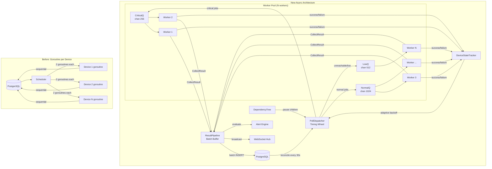

# High-Performance Async Poller & Worker Pool Engine

Redesign the polling and data-collection subsystem of Rayavriti NetMonitor to be asynchronous, worker-pool driven, and PRTG/Zabbix-inspired — enabling efficient collection of 10,000+ devices without goroutine explosion or head-of-line blocking.

## Current Architecture Problems

After a deep analysis of the codebase, here are the critical bottlenecks:

| Problem | Root Cause | Impact |
|---|---|---|
| **Goroutine-per-device** | `scheduleDevice()` spawns 2 goroutines per device (immediate + ticker) | At 5,000 devices = 10,000+ long-lived goroutines, unbounded growth |
| **No concurrency limit** | All devices collect simultaneously with no semaphore/pool | SNMP timeouts (5s) can block hundreds of goroutines; CPU/memory spikes |
| **Synchronous collectors** | `collectOnce()` runs sequentially: lock → collect → DB write → WS broadcast → alert eval | A slow SNMP walk (10s+) blocks the entire pipeline for that device |
| **DB query per tick** | Every ticker tick calls `s.db.GetDevice()` to re-fetch config | N×(1/interval) DB queries/sec just for config refresh |
| **No priority/urgency** | Critical infrastructure devices poll at the same cadence as printers | No fast-lane for core switches vs. low-priority endpoints |
| **Remote collector is sequential** | `poll()` iterates instances one-by-one with no concurrency | 20 remote instances × 4 API calls each = 80 sequential HTTP requests |
| **Metric buffer writes one-by-one** | `flush()` loops `RecordMetric()` per metric, no batch insert | N individual INSERT statements instead of 1 bulk INSERT |
| **No dead-device detection** | Unreachable devices (5s timeout × 3 retries = 15s) consume worker time | "Slow poison" effect: dead devices degrade healthy device monitoring |

## User Review Required

> [!IMPORTANT]
> **Breaking Change: Scheduler API.** The `Scheduler` struct will have a fundamentally different internal design. Any external code that reaches into `s.jobs` or relies on `scheduleDevice()` signatures will need updating.

> [!IMPORTANT]
> **New config env vars required.** Several new `POLLER_*` environment variables will be introduced. Existing `COLLECTOR_INTERVAL_SEC` will be preserved for backward compatibility but superseded by per-device intervals.

> [!WARNING]
> **Redis becomes more critical.** The new architecture uses Redis for the priority work queue. While fallback to in-memory queues will be supported, Redis-less deployments will lose distributed scheduling and backpressure guarantees.

## Open Questions

> [!IMPORTANT]
> **Q1: Worker pool sizing strategy.** Should the default worker count be auto-calculated from `runtime.NumCPU()` (e.g., `NumCPU * 4`), or do you prefer a fixed default like 32? PRTG uses ~50 threads per probe; Zabbix defaults to 5 pollers + 1 unreachable poller. 
> auto-calculated

> [!IMPORTANT]
> **Q2: Device priority model.** Should we introduce an explicit `priority` field on the Device model (e.g., `critical` / `high` / `normal` / `low`), or infer priority from protocol type and device role? PRTG uses sensor priority 1-5.
> introduce priority

> [!IMPORTANT]
> **Q3: Unreachable device segregation.** Zabbix uses dedicated "unreachable pollers" so slow/dead devices don't poison the main pool. Do you want a separate worker pool for unreachable devices, or a unified pool with priority demotion?
> use dedicated 

> [!IMPORTANT]
> **Q4: Batch insert for metrics.** The current `RecordMetric()` is a single-row INSERT. Should we add a new `RecordMetricsBatch(ctx, []*Metric) error` method to the `Database` interface, or keep the abstraction unchanged and batch only in the buffer layer?
> add batch insert
---

## Proposed Changes

### Phase 1: Worker Pool Engine (Core Infrastructure)

The heart of the redesign. Replaces goroutine-per-device with a bounded, priority-aware worker pool.

---

#### [NEW] [worker_pool.go](file:///home/yuvraj/Projects/Rayavriti%20NetMonitor/backend/internal/scheduler/worker_pool.go)

A fixed-size goroutine pool that pulls `PollJob`s from a priority channel.

```go
// Key design decisions (inspired by PRTG/Zabbix):
//
// 1. Fixed pool size (like PRTG's thread limit per probe)
// 2. Priority queue via multiple channels (critical > normal > low)  
// 3. Per-worker metrics (jobs completed, avg duration, errors)
// 4. Graceful drain on shutdown with configurable timeout
// 5. Adaptive scaling: can grow pool temporarily under load

type WorkerPool struct {
    workers    int
    maxWorkers int                // ceiling for adaptive scaling
    criticalQ  chan PollJob       // priority 0: core infrastructure
    normalQ    chan PollJob       // priority 1: standard devices
    lowQ       chan PollJob       // priority 2: low-priority / unreachable
    wg         sync.WaitGroup
    metrics    WorkerPoolMetrics  // exported for self-monitor
}

type PollJob struct {
    Device     models.Device
    Priority   int         // 0=critical, 1=normal, 2=low
    ScheduleAt time.Time   // when this job was enqueued
    Attempt    int         // retry count
}

type WorkerPoolMetrics struct {
    ActiveWorkers  atomic.Int64
    QueuedCritical atomic.Int64
    QueuedNormal   atomic.Int64
    QueuedLow      atomic.Int64
    Completed      atomic.Int64
    Errors         atomic.Int64
    AvgLatencyMs   atomic.Int64
}
```

**Worker selection logic** (inspired by Go select with priority):
```go
// Workers drain critical queue first, then normal, then low.
// This ensures core switches/routers are always polled before printers.
select {
case job := <-wp.criticalQ:
    wp.execute(ctx, job)
default:
    select {
    case job := <-wp.criticalQ:
        wp.execute(ctx, job)
    case job := <-wp.normalQ:
        wp.execute(ctx, job)
    default:
        select {
        case job := <-wp.criticalQ:
            wp.execute(ctx, job)
        case job := <-wp.normalQ:
            wp.execute(ctx, job)
        case job := <-wp.lowQ:
            wp.execute(ctx, job)
        case <-ctx.Done():
            return
        }
    }
}
```

---

#### [NEW] [poll_dispatcher.go](file:///home/yuvraj/Projects/Rayavriti%20NetMonitor/backend/internal/scheduler/poll_dispatcher.go)

Replaces the per-device goroutine+ticker model with a single timing wheel that dispatches `PollJob`s to the worker pool at the correct intervals.

```go
// Timing Wheel design (inspired by PRTG scanning intervals):
//
// Instead of N tickers (one per device), we maintain a sorted schedule
// heap. A single goroutine sleeps until the next due time, then 
// dispatches all due jobs into the worker pool's priority queues.
//
// Benefits:
// - O(log N) insert/remove vs O(N) goroutines
// - Single timer instead of N timers
// - Natural batching: devices due at similar times are dispatched together

type PollDispatcher struct {
    pool       *WorkerPool
    schedule   *ScheduleHeap        // min-heap sorted by nextPollAt
    deviceMap  map[int64]*ScheduleEntry  // quick lookup by device ID
    mu         sync.RWMutex
}

type ScheduleEntry struct {
    DeviceID   int64
    Device     models.Device
    Priority   int
    Interval   time.Duration
    NextPollAt time.Time
    State      DeviceState  // healthy / unreachable / paused
    Failures   int          // consecutive failures (for backoff)
}

type DeviceState int
const (
    StateHealthy     DeviceState = iota
    StateUnreachable             // 3+ consecutive failures
    StatePaused                  // user-paused or maintenance
)
```

**Adaptive interval backoff** (inspired by Zabbix unreachable pollers):
```
// When a device fails:
//   1st failure:  poll at normal interval
//   2nd failure:  poll at 2× interval
//   3rd+ failure: move to "unreachable" state, poll at 4× interval
//                 route to lowQ to avoid poisoning main pool
// When device recovers:
//   Reset to normal interval and healthy state immediately
```

---

#### [MODIFY] [scheduler.go](file:///home/yuvraj/Projects/Rayavriti%20NetMonitor/backend/internal/scheduler/scheduler.go)

Rewrite the `Scheduler` struct to orchestrate the new components instead of managing goroutines directly.

**Before**: `Scheduler` owns `jobs map[int64]context.CancelFunc`, spawns goroutines per device.
**After**: `Scheduler` owns `WorkerPool` + `PollDispatcher` + `ResultPipeline`.

```diff
 type Scheduler struct {
     db       database.Database
     registry *collectors.Registry
     hub      *websocket.Hub
     alertEng *engine.AlertEngine
     buffer   *cache.MetricBuffer
     rdb      *cache.Redis
-    jobs     map[int64]context.CancelFunc
-    mu       sync.Mutex
+    pool       *WorkerPool
+    dispatcher *PollDispatcher
+    pipeline   *ResultPipeline
     cancel   context.CancelFunc
     wg       sync.WaitGroup
-    jobCount atomic.Int64
+    config   SchedulerConfig
 }

+type SchedulerConfig struct {
+    WorkerCount       int           // default: NumCPU * 4
+    MaxWorkerCount    int           // adaptive scaling ceiling
+    CriticalQueueSize int           // default: 256
+    NormalQueueSize   int           // default: 1024
+    LowQueueSize      int           // default: 512
+    ReconcileInterval time.Duration // default: 30s
+    ResultBatchSize   int           // default: 100
+    ResultFlushMs     int           // default: 2000
+}
```

The `reconcile()` method changes from re-scheduling device goroutines to updating the `PollDispatcher`'s schedule heap entries.

---

### Phase 2: Async Collection Pipeline

Decouples data collection from result processing, allowing collectors to finish fast and results to be batched.

---

#### [NEW] [result_pipeline.go](file:///home/yuvraj/Projects/Rayavriti%20NetMonitor/backend/internal/scheduler/result_pipeline.go)

A fan-in pipeline that receives `CollectResult`s from workers and processes them in batches. Inspired by PRTG's probe-to-core data sync and Zabbix's history cache.

```go
// The pipeline runs 3 stages concurrently:
//
// [Workers] --result--> [BatchBuffer] --flush--> [Persister]
//                                            |
//                                            +--> [Broadcaster] (WebSocket)
//                                            +--> [AlertEvaluator]
//
// BatchBuffer uses dual-trigger flushing:
//   - SIZE: flush when buffer hits batchSize (e.g., 100 results)
//   - TIME: flush every flushInterval (e.g., 2 seconds)
// Whichever triggers first.

type CollectResult struct {
    Device       models.Device
    Result       *collectors.Result
    Duration     time.Duration
    Error        error
    PreviousStatus string
    CollectedAt  time.Time
}

type ResultPipeline struct {
    resultCh     chan CollectResult    // buffered: workers push here
    db           database.Database
    hub          *websocket.Hub
    alertEng     *engine.AlertEngine
    buffer       *cache.MetricBuffer
    batchSize    int
    flushMs      int
}
```

**Key advantage**: Workers return immediately after collecting, freeing them for the next device. DB writes, WebSocket broadcasts, and alert evaluation happen in the pipeline goroutine(s), not in the poller worker.

---

#### [MODIFY] [collector.go](file:///home/yuvraj/Projects/Rayavriti%20NetMonitor/backend/internal/collectors/collector.go)

Add timeout and metadata to the `Collector` interface without breaking existing implementations.

```diff
 type Collector interface {
     Name() string
     Collect(ctx context.Context, device *models.Device) (*Result, error)
 }

+// CollectorMeta provides optional metadata about collector behavior.
+// Collectors can implement this interface for fine-grained control.
+type CollectorMeta interface {
+    // DefaultTimeout returns the recommended timeout for this collector type.
+    // SNMP might return 10s, Ping 5s, HTTP 10s.
+    DefaultTimeout() time.Duration
+    
+    // Weight returns the relative cost of this collector (1-10).
+    // Used by the worker pool to avoid overloading with heavy collectors.
+    // SNMP=8 (walks tables), Ping=1 (single ICMP), HTTP=3, System=2.
+    Weight() int
+}

 type Result struct {
     Status       string
     ResponseTime *float64
     PacketLoss   *float64
     CPUUsage     *float64
     MemoryUsage  *float64
     Bandwidth    *float64
     Details      map[string]any
+    CollectedAt  time.Time  // when collection completed
 }
```

---

### Phase 3: Smart Scheduling (PRTG/Zabbix-Inspired)

#### [NEW] [device_state_tracker.go](file:///home/yuvraj/Projects/Rayavriti%20NetMonitor/backend/internal/scheduler/device_state_tracker.go)

Tracks per-device health state to enable intelligent scheduling decisions.

```go
// Inspired by:
// - PRTG sensor dependencies (pause child sensors if parent is down)
// - Zabbix unreachable host detection (separate unreachable pollers)
// - PRTG sensor states (Up/Down/Warning/Paused/Unknown)

type DeviceStateTracker struct {
    states map[int64]*DeviceHealth
    mu     sync.RWMutex
}

type DeviceHealth struct {
    DeviceID          int64
    CurrentStatus     string        // up / down / warning / unknown
    ConsecutiveFails  int
    LastSuccessAt     time.Time
    LastFailAt        time.Time
    LastResponseTime  time.Duration
    AvgResponseTime   time.Duration // rolling average (last 10)
    State             DeviceState   // healthy / unreachable / paused
    BackoffMultiplier int           // 1x, 2x, 4x interval
}

// Methods:
// RecordSuccess(deviceID, responseTime) - resets failure count, sets healthy
// RecordFailure(deviceID, err)          - increments fails, escalates state
// GetState(deviceID) -> DeviceHealth    - used by dispatcher for priority
// GetUnreachableDevices() -> []int64    - for monitoring dashboard
```

**Adaptive backoff table** (inspired by Zabbix's unreachable host handling):

| Consecutive Fails | State | Interval Multiplier | Queue |
|---|---|---|---|
| 0 | Healthy | 1× | normalQ / criticalQ |
| 1 | Healthy | 1× | normalQ |
| 2 | Healthy | 2× | normalQ |
| 3+ | Unreachable | 4× | lowQ |
| 10+ | Unreachable | 8× | lowQ |

---

#### [NEW] [dependency_tree.go](file:///home/yuvraj/Projects/Rayavriti%20NetMonitor/backend/internal/scheduler/dependency_tree.go)

PRTG-inspired sensor dependency model. If a parent device (e.g., core switch) goes down, pause polling of dependent devices to prevent alert storms and wasted poll cycles.

```go
// Optional: devices can declare a "depends_on" relationship.
// When a parent goes down:
//   1. All children are auto-paused (State = StatePaused)
//   2. Only the parent continues to be polled
//   3. When parent recovers, children auto-resume
//
// This prevents:
//   - Alert storms when a switch goes down (100+ child alerts)
//   - Wasting worker slots polling devices behind a dead switch
//   - False "down" status for devices that are actually fine

type DependencyTree struct {
    children map[int64][]int64  // parentID -> []childID
    parents  map[int64]int64    // childID -> parentID
    mu       sync.RWMutex
}
```

> This requires a new `depends_on_device_id` column on the devices table (nullable FK).

---

### Phase 4: Async Remote Collector

#### [MODIFY] [collector.go (remote)](file:///home/yuvraj/Projects/Rayavriti%20NetMonitor/backend/internal/remote/collector.go)

Make the remote instance poller concurrent instead of sequential.

```diff
 func (c *Collector) poll(ctx context.Context) {
     instances, err := c.store.Due(ctx)
     if err != nil {
         return
     }
-    for _, instance := range instances {
-        if instance.LastSeenAt != nil && ... {
-            continue
-        }
-        c.collect(ctx, instance)
-    }
+    // Fan-out: collect all due instances concurrently with bounded parallelism
+    sem := make(chan struct{}, 10) // max 10 concurrent remote fetches
+    var wg sync.WaitGroup
+    for _, instance := range instances {
+        if instance.LastSeenAt != nil && ... {
+            continue
+        }
+        wg.Add(1)
+        sem <- struct{}{} // acquire semaphore
+        go func(inst Instance) {
+            defer wg.Done()
+            defer func() { <-sem }() // release semaphore
+            c.collect(ctx, inst)
+        }(instance)
+    }
+    wg.Wait()
     if c.retentionDays > 0 {
         _ = c.store.PruneSnapshots(ctx, c.retentionDays)
     }
 }
```

Additionally, implement **connection pooling** for the HTTP client:

```diff
-func (c *Collector) client(skip bool) *http.Client {
-    return &http.Client{Timeout: c.timeout, Transport: &http.Transport{...}}
-}
+// Reuse a single transport with connection pooling instead of
+// creating a new http.Client per request
+var (
+    pooledTransport = &http.Transport{
+        MaxIdleConnsPerHost: 5,
+        IdleConnTimeout:     90 * time.Second,
+        TLSClientConfig:     &tls.Config{InsecureSkipVerify: true},
+    }
+    pooledClient = &http.Client{Transport: pooledTransport}
+)
```

---

### Phase 5: Batch Database Operations

#### [MODIFY] [metric_buffer.go](file:///home/yuvraj/Projects/Rayavriti%20NetMonitor/backend/internal/cache/metric_buffer.go)

Replace one-by-one `RecordMetric()` calls with batch INSERT using PostgreSQL `COPY` or multi-value INSERT.

```diff
 func (b *MetricBuffer) flush(ctx context.Context) {
     // ... pop from Redis ...
-    for _, raw := range items {
-        var m models.Metric
-        if err := json.Unmarshal([]byte(raw), &m); err != nil {
-            continue
-        }
-        if err := b.db.RecordMetric(ctx, &m); err != nil {
-            slog.Warn("Failed to record buffered metric", ...)
-        }
-    }
+    metrics := make([]*models.Metric, 0, len(items))
+    for _, raw := range items {
+        var m models.Metric
+        if err := json.Unmarshal([]byte(raw), &m); err != nil {
+            continue
+        }
+        metrics = append(metrics, &m)
+    }
+    if len(metrics) > 0 {
+        if err := b.db.RecordMetricsBatch(ctx, metrics); err != nil {
+            slog.Warn("Batch insert failed, falling back to individual inserts", ...)
+            for _, m := range metrics {
+                _ = b.db.RecordMetric(ctx, m)
+            }
+        }
+    }
 }
```

#### [MODIFY] Database interface — add batch method

```diff
// In database/database.go
 type Database interface {
     // ... existing methods ...
     RecordMetric(ctx context.Context, metric *Metric) error
+    RecordMetricsBatch(ctx context.Context, metrics []*Metric) error
 }
```

**Implementation** using PostgreSQL `pgx.CopyFrom` for maximum throughput:
```go
func (pg *Postgres) RecordMetricsBatch(ctx context.Context, metrics []*models.Metric) error {
    rows := make([][]any, len(metrics))
    for i, m := range metrics {
        rows[i] = []any{m.DeviceID, m.DeviceName, m.Protocol, m.Timestamp, 
                        m.Status, m.ResponseTime, m.PacketLoss, m.CPUUsage, 
                        m.MemoryUsage, m.Bandwidth, m.Details}
    }
    _, err := pg.pool.CopyFrom(ctx,
        pgx.Identifier{"metrics"},
        []string{"device_id", "device_name", "protocol", "timestamp", 
                 "status", "response_time", "packet_loss", "cpu_usage",
                 "memory_usage", "bandwidth", "details"},
        pgx.CopyFromRows(rows),
    )
    return err
}
```

---

### Phase 6: Configuration & Observability

#### [MODIFY] [config.go](file:///home/yuvraj/Projects/Rayavriti%20NetMonitor/backend/internal/config/config.go)

Add new configuration options:

```diff
 type CollectorConfig struct {
     // ... existing fields ...
     CollectorIntervalSec  int
+    // Worker pool settings
+    PollerWorkerCount       int   // default: NumCPU * 4
+    PollerMaxWorkerCount    int   // adaptive scaling ceiling
+    PollerCriticalQueueSize int   // default: 256
+    PollerNormalQueueSize   int   // default: 1024
+    PollerLowQueueSize      int   // default: 512
+    PollerResultBatchSize   int   // default: 100
+    PollerResultFlushMs     int   // default: 2000
+    // Remote collector settings
+    RemoteMaxConcurrent     int   // default: 10
 }
```

#### [MODIFY] [self_monitor.go](file:///home/yuvraj/Projects/Rayavriti%20NetMonitor/backend/internal/monitoring/self_monitor.go)

Expose worker pool metrics to the self-monitoring system:

```diff
 type SelfMonitor struct {
     // ... existing fields ...
+    WorkerPoolMetrics  func() WorkerPoolMetricsSnapshot
+    DispatcherMetrics  func() DispatcherMetricsSnapshot
 }
```

New metrics to track:
- `poller_active_workers` — how many workers are currently executing
- `poller_queue_critical` / `_normal` / `_low` — queue depths
- `poller_jobs_completed_total` — total collections completed
- `poller_errors_total` — total collection failures
- `poller_avg_latency_ms` — rolling average collection time
- `poller_unreachable_devices` — count of devices in unreachable state
- `poller_paused_devices` — count of dependency-paused devices

---

### Phase 7: Database Schema Changes

#### [MODIFY] Migrations — add device priority and dependency columns

```sql
-- Add priority and dependency support to devices table
ALTER TABLE devices ADD COLUMN IF NOT EXISTS priority INT DEFAULT 1;
-- priority: 0=critical, 1=normal, 2=low

ALTER TABLE devices ADD COLUMN IF NOT EXISTS depends_on_device_id BIGINT REFERENCES devices(id) ON DELETE SET NULL;
-- nullable FK for PRTG-style sensor dependencies

-- Index for efficient unreachable device queries
CREATE INDEX IF NOT EXISTS idx_devices_priority ON devices(priority) WHERE enabled = true;
```

---

## Architecture Diagram



---

## Implementation Order

| Step | Component | Effort | Dependencies |
|---|---|---|---|
| 1 | `WorkerPool` | 2 days | None |
| 2 | `PollDispatcher` (timing wheel) | 2 days | WorkerPool |
| 3 | `ResultPipeline` | 1 day | None |
| 4 | Rewrite `Scheduler` to orchestrate new components | 2 days | Steps 1-3 |
| 5 | `DeviceStateTracker` + adaptive backoff | 1 day | Step 4 |
| 6 | `CollectorMeta` interface + timeout per collector | 0.5 day | None |
| 7 | Batch `RecordMetricsBatch` + COPY | 1 day | None |
| 8 | Async remote collector (semaphore + connection pool) | 0.5 day | None |
| 9 | Config changes + env vars | 0.5 day | Steps 1-4 |
| 10 | `DependencyTree` + DB migration | 1 day | Step 5 |
| 11 | Self-monitor metrics integration | 0.5 day | Steps 1-5 |
| 12 | Update existing tests + new unit tests | 2 days | All above |

**Total estimated effort: ~14 days**

---

## Verification Plan

### Automated Tests

```bash
# Run existing tests to verify no regressions
cd backend && go test ./internal/scheduler/... -v -race -count=1

# Run new worker pool tests
go test ./internal/scheduler/ -run TestWorkerPool -v -race

# Run new dispatcher tests  
go test ./internal/scheduler/ -run TestPollDispatcher -v -race

# Run pipeline tests
go test ./internal/scheduler/ -run TestResultPipeline -v -race

# Run batch insert tests
go test ./internal/cache/ -run TestMetricBuffer -v -race
go test ./internal/database/ -run TestRecordMetricsBatch -v -race

# Full test suite with race detector
go test ./... -race -count=1

# Lint
golangci-lint run ./...
```

### Performance Tests

```bash
# Benchmark worker pool throughput
go test ./internal/scheduler/ -run=^$ -bench=BenchmarkWorkerPool -benchmem

# Benchmark batch vs individual metric inserts
go test ./internal/database/ -bench=BenchmarkRecordMetrics -benchmem
```

### Manual Verification
- Load test with 1,000+ simulated devices to verify bounded goroutine count
- Monitor memory/CPU usage before and after under load
- Verify WebSocket broadcasts still arrive in real-time
- Verify alert evaluation still triggers correctly
- Test graceful shutdown drains all queued jobs
- Test device state transitions (healthy → unreachable → healthy)
- Verify unreachable devices don't starve healthy device polling
